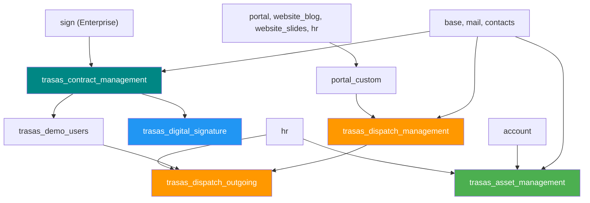

# Hướng dẫn cài đặt TRASAS Custom Addons

> **Odoo 19.0 Enterprise** | Docker Compose | PostgreSQL 15

---

## 1. Yêu cầu hệ thống

| Thành phần | Phiên bản |
|---|---|
| Docker Desktop | ≥ 4.x |
| Docker Compose | ≥ 3.8 |
| Odoo | 19.0 Enterprise (bản `odoo-19.0+e.20250918`) |
| PostgreSQL | 15 |

> [!IMPORTANT]
> Module `trasas_contract_management` depends vào `sign` (Odoo Sign) — đây là module **Enterprise**.
> Đảm bảo bạn đang dùng bản Odoo **Enterprise** có sẵn module `sign`.
> Nếu dùng Community, xem phần [Xử lý sự cố](#6-xử-lý-sự-cố) để bỏ dependency này.

---

## 2. Sơ đồ module & thứ tự cài đặt



### Thứ tự cài đặt khuyến nghị

| Bước | Module | Loại | Ghi chú |
|---:|---|---|---|
| 1 | `portal_custom` | Phụ trợ | Portal mở rộng |
| 2 | `trasas_contract_management` | **Ứng dụng** | Quản lý hợp đồng (cần `sign`) |
| 3 | `trasas_demo_users` | Dữ liệu demo | 5 user test + 4 phòng ban |
| 4 | `trasas_dispatch_management` | **Ứng dụng** | Quản lý công văn đến |
| 5 | `trasas_dispatch_outgoing` | Mở rộng | Quản lý công văn đi |
| 6 | `trasas_asset_management` | **Ứng dụng** | Quản lý tài sản |
| 7 | `trasas_digital_signature` | Mở rộng | Chữ ký số (Demo + DocuSign) |

---

## 3. Cài đặt từng bước

### Bước 1: Clone repository

```powershell
cd D:\Tech\odoo-19.0+e.20250918
git clone <repo-url> custom_addons_project2
```

### Bước 2: Kiểm tra cấu hình Docker

File `docker-compose.yml` đã mount sẵn thư mục:

```yaml
volumes:
  - ./custom_addons_project2:/mnt/custom_addons_project2
  - ./odoo.conf:/opt/odoo/odoo.conf
```

File `odoo.conf` đã có `addons_path` trỏ tới:

```ini
addons_path = /opt/odoo/odoo/addons,/mnt/extra-addons,/mnt/custom_addons_project2,...
```

> [!TIP]
> Nếu bạn clone vào thư mục khác, hãy cập nhật `docker-compose.yml` và `odoo.conf` tương ứng.

### Bước 3: Khởi động Docker

```powershell
cd D:\Tech\odoo-19.0+e.20250918
docker-compose up -d
```

Chờ khoảng 30s để Odoo khởi động hoàn tất.

### Bước 4: Cập nhật danh sách module

1. Truy cập `http://localhost:8069`
2. Đăng nhập với tài khoản admin
3. Bật **Developer Mode**: `Settings` → `Activate the developer mode`
4. Vào `Apps` → bấm **Update Apps List** → **Update**

### Bước 5: Cài đặt module theo thứ tự

Vào `Apps`, tìm kiếm và bấm **Install** lần lượt:

```
1. portal_custom
2. TRASAS Contract Management
3. TRASAS Demo Users          (tùy chọn — chỉ cần cho môi trường test)
4. TRASAS Dispatch Management
5. TRASAS Dispatch Outgoing
6. TRASAS Asset Management
7. TRASAS Digital Signature   (tùy chọn — cần Contract Management trước)
```

> [!NOTE]
> Khi cài `TRASAS Contract Management`, Odoo sẽ tự động cài `sign`, `mail`, `contacts` nếu chưa có.
> Khi cài `TRASAS Dispatch Outgoing`, Odoo sẽ tự động cài `hr`, `trasas_demo_users`.

**Hoặc cài bằng dòng lệnh (trong Docker container):**

```bash
docker exec -it odoo-190e20250918-web-1 bash

# Cài tất cả cùng lúc
odoo -c /opt/odoo/odoo.conf -d <tên_database> \
  -i portal_custom,trasas_contract_management,trasas_demo_users,trasas_dispatch_management,trasas_dispatch_outgoing,trasas_asset_management,trasas_digital_signature \
  --stop-after-init
```

---

## 4. Tài khoản demo (sau khi cài `trasas_demo_users`)

| Tên | Email (Login) | Mật khẩu | Vai trò |
|---|---|---|---|
| Trần Văn Minh | `giamdoc@trasas.com` | `trasas2026` | Giám đốc / Approver |
| Nguyễn Thị Lan | `hcns.truong@trasas.com` | `trasas2026` | Trưởng HCNS / Manager |
| Phạm Văn Hùng | `hcns.nv@trasas.com` | `trasas2026` | NV HCNS / User |
| Lê Thị Mai | `vanhanh@trasas.com` | `trasas2026` | NV Vận hành / User |
| Hoàng Văn Nam | `ketoan@trasas.com` | `trasas2026` | NV Kế toán / User |

---

## 5. Cấu hình sau cài đặt

### 5.1 Cấu hình email (gửi thông báo)

Vào `Settings` → `Technical` → `Outgoing Mail Servers` kiểm tra SMTP:

| Trường | Giá trị |
|---|---|
| Server | `smtp.gmail.com` |
| Port | `587` |
| Security | STARTTLS |
| Username | Email công ty |
| Password | App Password (nếu Gmail) |

### 5.2 Chữ ký số (Digital Signature)

Sau khi cài `trasas_digital_signature`:

1. Vào menu **Hợp đồng** → **Cấu hình** → **Nhà cung cấp chữ ký số**
2. Provider **Demo (Mô phỏng)** đã được tạo sẵn — dùng để test luồng ký
3. Để dùng **DocuSign thực tế**: xem phần [Xử lý sự cố](#docusign-chưa-hoàn-thiện)

#### Test nhanh luồng Demo:

1. Tạo hợp đồng → Gửi duyệt → Phê duyệt
2. Trên hợp đồng đã duyệt → bấm **Tạo yêu cầu ký số**
3. Chọn Provider = `Demo (Mô phỏng)`, upload file PDF
4. Bấm **Gửi yêu cầu ký** → hệ thống tạo link ký giả lập
5. Click link ký → hiện trang xác nhận "Ký thành công (Demo)"

---

## 6. Xử lý sự cố

### Lỗi: Module không hiện trên Apps list

```bash
# Restart container
docker-compose restart web

# Hoặc force update module list
docker exec -it odoo-190e20250918-web-1 \
  odoo -c /opt/odoo/odoo.conf -d <tên_database> --stop-after-init -u base
```

### Lỗi: `sign` module not found (Odoo Community)

Nếu bạn dùng **Odoo Community** (không có module `sign`):

1. Mở `trasas_contract_management/__manifest__.py`
2. Xóa dòng `"sign"` khỏi `depends`:
   ```diff
    "depends": [
        "base",
        "mail",
        "contacts",
   -    "sign",
    ],
   ```
3. Mở `trasas_contract_management/models/contract.py`
4. Xóa hoặc comment 2 dòng:
   ```diff
   -sign_request_ids = fields.One2many("sign.request", "contract_id", string="Yêu cầu ký")
   -sign_request_count = fields.Integer(string="Số yêu cầu ký", compute="_compute_sign_request_count")
   ```
5. Xóa hoặc comment method `_compute_sign_request_count`
6. Restart Odoo

### DocuSign chưa hoàn thiện

DocuSign provider hiện tại chỉ hỗ trợ `send_document`. Ba method sau đang là **stub**:
- `_docusign_get_status()` — Kiểm tra trạng thái
- `_docusign_download_signed()` — Tải file đã ký
- `_docusign_cancel()` — Hủy envelope

Ngoài ra, `"docusign"` chưa được thêm vào `_get_provider_types()`, nên **chưa chọn được** từ giao diện.

> **Kết luận:** Hiện tại chỉ nên dùng **Demo provider** để test. DocuSign cần được hoàn thiện thêm.

### Lỗi: Database connection refused

Kiểm tra container PostgreSQL:

```bash
docker ps
docker logs odoo-190e20250918-db-1
```

Đảm bảo `db_host`, `db_port`, `db_user`, `db_password` trong `odoo.conf` khớp với `docker-compose.yml`.

---

## 7. Cập nhật / Nâng cấp module

Sau khi sửa code, chạy upgrade:

```bash
# Upgrade một module cụ thể
docker exec -it odoo-190e20250918-web-1 \
  odoo -c /opt/odoo/odoo.conf -d <tên_database> \
  -u trasas_contract_management --stop-after-init

# Hoặc upgrade tất cả custom modules
docker exec -it odoo-190e20250918-web-1 \
  odoo -c /opt/odoo/odoo.conf -d <tên_database> \
  -u trasas_contract_management,trasas_dispatch_management,trasas_dispatch_outgoing,trasas_asset_management,trasas_digital_signature \
  --stop-after-init
```

Sau đó restart:

```bash
docker-compose restart web
```

---

## 8. Cấu trúc thư mục

```
custom_addons_project2/
├── portal_custom/              # Portal mở rộng
├── trasas_contract_management/ # Quản lý hợp đồng (Application)
├── trasas_demo_users/          # Dữ liệu demo users
├── trasas_dispatch_management/ # Quản lý công văn đến (Application)
├── trasas_dispatch_outgoing/   # Quản lý công văn đi
├── trasas_asset_management/    # Quản lý tài sản (Application)
├── trasas_digital_signature/   # Chữ ký số API
├── docusign/                   # DocuSign connector (3rd party)
├── contract/                   # Module hợp đồng bổ sung
├── *.pdf                       # Tài liệu quy trình nghiệp vụ
├── INSTALLATION.md             # ← File này
└── README.md
```
