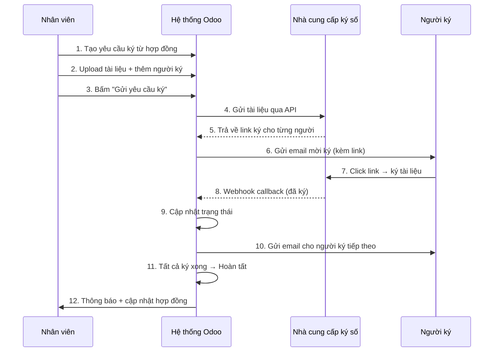
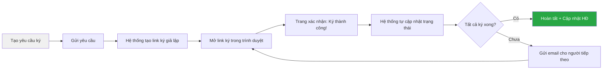

# Hướng dẫn sử dụng Module Chữ ký số TRASAS

> Module: `trasas_digital_signature` | Odoo 19.0

---

## 1. Tổng quan

Module Chữ ký số cho phép **gửi hợp đồng để ký số điện tử** thông qua nhà cung cấp bên ngoài (Demo, DocuSign, FPT.eSign, VNPT-CA...).

### Luồng hoạt động tổng quát

---

## 2. Điều kiện trước khi sử dụng

- [x] Đã cài module `trasas_contract_management`
- [x] Đã cài module `trasas_digital_signature`
- [x] Hợp đồng ở trạng thái **"Đã duyệt" (Approved)** hoặc **"Đang ký" (Signing)**
- [x] User thuộc nhóm `Contract User` trở lên

---

## 3. Hướng dẫn từng bước

### Bước 1: Mở hợp đồng đã duyệt

1. Vào menu **Hợp đồng** → **Hợp đồng**
2. Chọn một hợp đồng có trạng thái **"Đã duyệt"**

### Bước 2: Tạo yêu cầu ký số

1. Trên form hợp đồng, bấm nút **"Tạo yêu cầu ký số"**
2. Hệ thống mở form **Yêu cầu ký số** mới với thông tin đã được điền sẵn:
   - **Hợp đồng**: Liên kết tự động
   - **Luồng ký**: Theo cấu hình hợp đồng (TRASAS ký trước / Đối tác ký trước)
   - **Hạn ký**: Theo hạn ký của hợp đồng
   - **Người ký**: 2 người ký mặc định (Nội bộ + Đối tác)

### Bước 3: Điền thông tin yêu cầu

| Trường | Mô tả | Bắt buộc |
|---|---|---|
| **Nhà cung cấp** | Chọn provider (mặc định: Demo) | ✅ |
| **Luồng ký** | TRASAS ký trước / Đối tác ký trước | ✅ |
| **Hạn ký** | Ngày hết hạn yêu cầu ký | Không |
| **Tài liệu cần ký** | Upload file PDF hợp đồng | ✅ |

### Bước 4: Kiểm tra danh sách người ký

Chuyển sang tab **"Người ký"**:

| Cột | Mô tả |
|---|---|
| **Thứ tự ký** | Số nhỏ ký trước (VD: 1, 2) |
| **Liên hệ** | Chọn từ danh bạ → tự điền tên và email |
| **Vai trò** | Nội bộ (TRASAS) hoặc Đối tác |
| **Tên người ký** | Tên hiển thị |
| **Email** | Email nhận link ký — **bắt buộc** |

> [!TIP]
> - Thứ tự ký quyết định ai ký trước, ai ký sau
> - Có thể thêm nhiều hơn 2 người ký
> - Người ký cùng thứ tự sẽ nhận link ký cùng lúc

### Bước 5: Gửi yêu cầu ký

1. Bấm nút **"Gửi yêu cầu ký"** (chỉ hiện khi trạng thái = Nháp)
2. Hệ thống sẽ:
   - Gửi tài liệu đến nhà cung cấp
   - Tạo link ký cho từng người
   - Gửi email mời ký cho người ký đầu tiên
   - Chuyển hợp đồng sang trạng thái **"Đang ký"**

### Bước 6: Theo dõi tiến trình

Trên form yêu cầu ký:

| Trạng thái | Ý nghĩa |
|---|---|
| **Nháp** | Chưa gửi, có thể chỉnh sửa |
| **Đã gửi** | Đã gửi đến NCC, chờ người ký |
| **Ký một phần** | Có ít nhất 1 người đã ký |
| **Hoàn tất** | Tất cả đã ký xong |
| **Đã hủy** | Bị hủy bởi quản lý |
| **Hết hạn** | Quá hạn ký (cron tự kiểm tra) |

Cột trạng thái người ký:

| Badge | Ý nghĩa |
|---|---|
| 🔵 `Đã gửi` | Đã gửi email mời ký |
| 🟢 `Đã ký` | Đã ký thành công |
| 🔴 `Từ chối` | Người ký từ chối |
| ⚪ `Chờ` | Chưa đến lượt |

### Bước 7: Khi hoàn tất ký

Khi tất cả người ký hoàn tất, hệ thống **tự động**:

1. Tải file đã ký từ nhà cung cấp
2. Lưu vào trường **"Tài liệu đã ký"** trên yêu cầu
3. Cập nhật hợp đồng:
   - `internal_sign_date` = ngày nội bộ ký
   - `partner_sign_date` = ngày đối tác ký
   - `final_scan_file` = file PDF đã ký
4. Nếu đủ điều kiện → chuyển hợp đồng sang **"Đã ký" (Signed)**

---

## 4. Các thao tác khác

### Kiểm tra trạng thái thủ công

Bấm nút **"Kiểm tra trạng thái"** trên yêu cầu ký đang xử lý để truy vấn NCC ngay lập tức (không cần chờ cron).

### Hủy yêu cầu ký

- Quyền: chỉ nhóm **Contract Manager**
- Bấm nút **"Hủy"** → xác nhận
- Hệ thống sẽ gửi lệnh hủy đến NCC

### Xem từ hợp đồng

Trên form hợp đồng có nút **smart button** hiển thị số lượng yêu cầu ký. Bấm vào để xem danh sách.

---

## 5. Sử dụng Demo Provider (Môi trường test)

Provider **"Demo (Mô phỏng)"** được tạo sẵn khi cài module. Luồng test:

### Cách test nhanh:

1. Tạo hợp đồng → duyệt xong
2. Bấm **"Tạo yêu cầu ký số"**
3. Chọn **Provider = Demo (Mô phỏng)**
4. Upload file PDF bất kỳ
5. Bấm **"Gửi yêu cầu ký"**
6. Vào tab **Người ký** → cột **Link ký** → click link
7. Trình duyệt hiện: *"Ký thành công! (Demo)"*
8. Quay lại Odoo → refresh → trạng thái người ký chuyển sang **"Đã ký"**
9. Lặp lại cho người ký thứ 2
10. Khi cả hai ký xong → yêu cầu chuyển **"Hoàn tất"**, hợp đồng chuyển **"Đã ký"**

> [!NOTE]
> Link ký Demo có dạng: `http://localhost:8069/trasas/signature/demo/<token>/<signer_id>`
> Chỉ hoạt động trên cùng server Odoo (localhost hoặc domain đã cấu hình).

---

## 6. Cron Jobs tự động

| Cron | Tần suất | Chức năng |
|---|---|---|
| Kiểm tra trạng thái ký | Mỗi giờ | Poll NCC lấy trạng thái mới nhất (fallback cho webhook) |
| Kiểm tra hết hạn | Mỗi ngày | Chuyển yêu cầu quá hạn sang trạng thái "Hết hạn" |

---

## 7. Phân quyền

| Nhóm | Quyền trên Chữ ký số |
|---|---|
| **Contract User** | Tạo/sửa yêu cầu của mình, xem tất cả yêu cầu ký |
| **Contract Approver** | Xem, sửa tất cả yêu cầu ký |
| **Contract Manager** | Full quyền + cấu hình nhà cung cấp + hủy yêu cầu |

---

## 8. Câu hỏi thường gặp

**Q: Người ký không nhận được email?**
> Kiểm tra: (1) Email đã nhập đúng, (2) Outgoing Mail Server đã cấu hình, (3) Kiểm tra log Odoo.

**Q: Trạng thái không cập nhật sau khi ký?**
> Bấm **"Kiểm tra trạng thái"** để poll thủ công. Nếu dùng Demo, đảm bảo đã click link ký thành công.

**Q: Muốn thêm nhà cung cấp mới?**
> Vào **Hợp đồng** → **Cấu hình** → **Nhà cung cấp chữ ký số** → **Tạo mới**. Chọn loại nhà cung cấp, nhập API URL và API Key.

**Q: Hợp đồng không tự chuyển "Đã ký"?**
> Cần đủ 3 điều kiện: (1) `internal_sign_date` có giá trị, (2) `partner_sign_date` có giá trị, (3) `final_scan_file` đã upload. Kiểm tra tab chi tiết trên hợp đồng.
