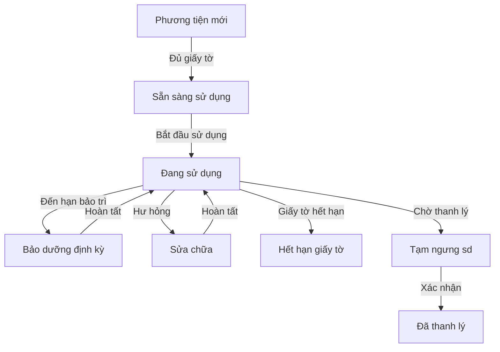

# 📋 HƯỚNG DẪN SỬ DỤNG — Module Quản lý Phương tiện TRASAS

> **Module:** `trasas_fleet_management`  
> **Phiên bản:** 1.0  
> **Đối tượng sử dụng:** Phòng HCNS (toàn quyền) & Ban Giám đốc (tra cứu)

---

## Mục lục

1. [Tổng quan quy trình](#1-tổng-quan-quy-trình)
2. [Phân quyền người dùng](#2-phân-quyền-người-dùng)
3. [Quy trình quản lý phương tiện](#3-quy-trình-quản-lý-phương-tiện)
4. [Tự công hóa & Cảnh báo](#4-tự-động-hóa--cảnh-báo)
5. [Quản lý hồ sơ pháp lý](#5-quản-lý-hồ-sơ-pháp-lý)
6. [Cấu trúc menu](#6-cấu-trúc-menu)

---

## 1. Tổng quan quy trình

Quy trình quản lý phương tiện nội bộ được thiết kế để theo dõi vòng đời của một phương tiện từ khi mới về cho đến khi được thanh lý, đảm bảo tất cả giấy tờ pháp lý và bảo trì đều được cập nhật đúng hạn.

---

## 2. Phân quyền người dùng

Quyền hạn được kế thừa và mở rộng từ hệ thống Fleet chuẩn của Odoo:

| Nhóm quyền | Vai trò | Quyền |
|------------|---------|-------|
| **Fleet User** | Nhân viên HCNS / Tài xế | Tạo xe, cập nhật chỉ số Odometer, xem thông tin xe |
| **Fleet Administrator** | Quản lý HCNS | Phê duyệt chuyển trạng thái, thay đổi cấu hình, quản lý hồ sơ pháp lý |
| **Ban Giám đốc** | Ban Giám đốc | Chỉ xem và tra cứu hồ sơ pháp lý/tình trạng xe |

---

## 3. Quy trình quản lý phương tiện

### Bước 1: Tạo mới & Cấp mã 🔢
Khi tạo mới một phương tiện, hệ thống sẽ tự động cấp mã theo định dạng:
**STT.YY/PT-TRS** (Ví dụ: `01.26/PT-TRS`).
- **STT**: Số thứ tự tăng dần (reset theo năm).
- **YY**: Hai số cuối của năm hiện tại.

### Bước 2: Chuẩn bị hồ sơ 📄
- Trạng thái ban đầu là **Phương tiện mới**.
- Nhân viên HCNS tiến hành upload các hồ sơ cần thiết (Đăng kiểm, Bảo hiểm...) vào tab **"Hồ sơ pháp lý"**.
- Khi đủ điều kiện, nhấn nút **"Sẵn sàng sử dụng"**.

### Bước 3: Đưa vào sử dụng 🚗
Khi xe thực tế được bàn giao sử dụng:
1. Nhấn nút **"Bắt đầu sử dụng"**.
2. **Yêu cầu bắt buộc**: Phải nhập **Thời gian sử dụng** và **Thời gian bảo dưỡng định kỳ**.
3. Hệ thống sẽ ghi nhận **Ngày bắt đầu sử dụng** để tính toán lịch bảo trì tự động.

### Bước 4: Vận hành & Bảo trì 🔧
- **Bảo dưỡng**: Hệ thống tự động chuyển trạng thái trước 5 ngày khi đến hạn bảo trì định kỳ (mặc định là 180 ngày kể từ ngày bắt đầu sử dụng).
- **Sửa chữa**: Nếu xe hỏng đột xuất, người dùng nhấn nút **"Sửa chữa"** thủ công.
- Sau khi xong, nhấn **"Đưa lại sử dụng"** để đưa xe về trạng thái hoạt động bình thường.

### Bước 5: Thanh lý 🗑️
- Khi xe không còn sử dụng, nhấn **"Tạm ngưng sd"**. Lúc này xe sẽ chờ duyệt thanh lý.
- Tại trạng thái này, nút **"Thanh lý"** (màu đỏ) sẽ xuất hiện để xác nhận kết thúc vòng đời phương tiện.

---

## 4. Tự động hóa & Cảnh báo

Hệ thống chạy ngầm hàng ngày để kiểm tra các thời hạn:

- **Cảnh báo giấy tờ**: Tạo Activity nhắc việc trước **30 ngày, 15 ngày và 7 ngày** khi Đăng kiểm hoặc Bảo hiểm sắp hết hạn.
- **Tự động chuyển khóa**: Nếu qua ngày hết hạn mà chưa được gia hạn, xe sẽ tự động chuyển sang trạng thái **Hết hạn giấy tờ**.
- **Cảnh báo bảo trì**: Gửi thông báo cho Tài xế và Người phụ trách trước **5 ngày** khi đến mốc bảo dưỡng (STT.YY + 180 ngày).

---

## 5. Quản lý hồ sơ pháp lý

Tab **Hồ sơ pháp lý** trong form xe cho phép:
- Lưu trữ cùng lúc nhiều loại giấy tờ: Đăng kiểm, Bảo hiểm, Giấy tờ sở hữu.
- Theo dõi **Ngày cập nhật file**: Lưu lại vết thời gian upload hồ sơ gần nhất.
- Đính kèm nhiều file (PDF, hình ảnh) cho mỗi đầu mục.

---

## 6. Cấu trúc menu

- **Đội xe (Fleet)**:
    - **Phương tiện**: Danh sách xe và công cụ tra cứu.
    - **Dịch vụ**: Theo dõi lịch sử bảo trì/sửa chữa gắn liền với chỉ số công tơ mét.
    - **Hồ sơ pháp lý**: Tổng hợp toàn bộ hồ sơ bản scan trên hệ thống.
    - **Báo cáo**: Xuất báo cáo khấu hao, chi phí vận hành.

---

> **Lưu ý:** Các nút chức năng sẽ thay đổi động dựa trên trạng thái hiện tại của xe để đảm bảo quy trình luôn đi đúng hướng.  
> **Phiên bản tài liệu:** v1.0 — Cập nhật 25/02/2026
