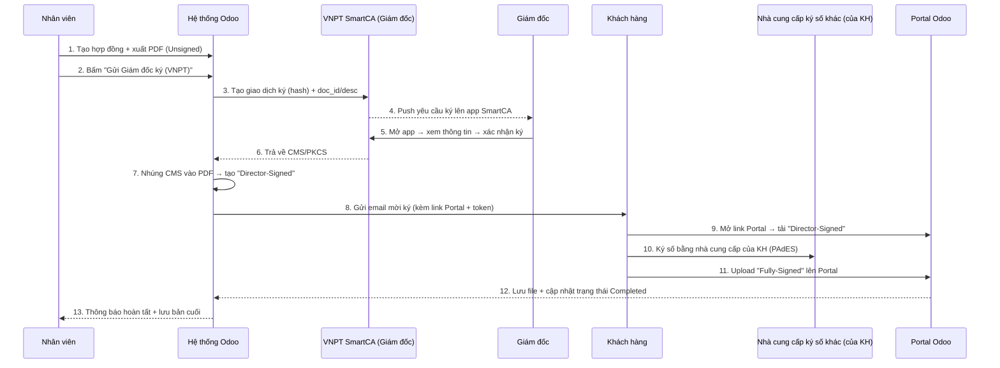

QUY TRÌNH

Tạo hợp đồng trên Odoo → xuất và lưu PDF bản gốc (Unsigned).

Nhấn Gửi Giám đốc ký (VNPT SmartCA) → app SmartCA hiện yêu cầu → Giám đốc xác nhận trên app.

Odoo lấy chữ ký (CMS) từ SmartCA và tạo PDF đã ký bởi công ty (Director-Signed).

Odoo gửi email cho khách kèm link Portal.

Khách vào Portal tải Director-Signed, ký bằng nhà cung cấp chữ ký số của họ, rồi upload lại PDF đã ký đầy đủ.

Odoo lưu Fully-Signed và chuyển hợp đồng sang Completed.

# Hướng dẫn sử dụng Hợp đồng ký số VNPT SmartCA

> Module: `vnpt_smartca_contract_sign` | Odoo 19.0

---

## 1. Tổng quan

Module Chữ ký số cho phép **gửi hợp đồng để ký số điện tử** thông qua nhà cung cấp bên ngoài (Demo, DocuSign, FPT.eSign, VNPT-CA...).

### Luồng hoạt động tổng quát

